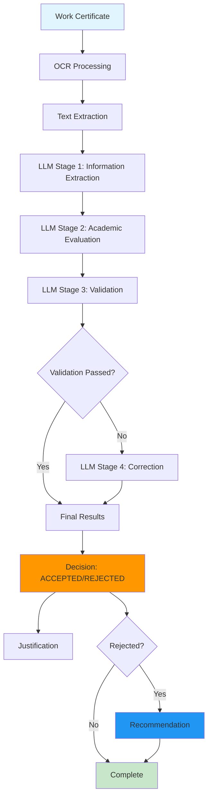

# AI-Powered Academic Credit Evaluation System

This project provides a **comprehensive AI-powered pipeline** for evaluating work certificates and determining academic credits for higher education institutions. It combines **advanced OCR processing** with **4-stage LLM evaluation** to automatically assess work experience and provide evidence-based recommendations for practical training credit evaluation.

## 🎯 System Overview

The system processes work certificates through a sophisticated pipeline that:
1. **Extracts text** from various document formats (PDF, DOCX, images)
2. **Analyzes work experience** against degree-specific criteria
3. **Evaluates training type requests** (General vs Professional)
4. **Provides clear decisions** (ACCEPTED/REJECTED) with justifications
5. **Offers actionable recommendations** for rejected cases

## 🚀 Key Features

- **🔍 Advanced OCR Processing**: High-accuracy text extraction using Tesseract with OpenCV preprocessing
- **🤖 AI-Powered Evaluation**: 4-stage LLM pipeline for intelligent work experience analysis
- **🎓 Degree-Specific Analysis**: Custom evaluation criteria for different academic programs
- **📋 Decision System**: Clear ACCEPTED/REJECTED decisions with detailed justifications
- **💡 Smart Recommendations**: Actionable guidance for rejected applications
- **📄 Multi-Format Support**: PDF, DOCX, DOC, JPG, PNG, BMP, TIFF, and TIF files
- **🖼️ Intelligent Image Preprocessing**: Automatic noise removal, grayscale conversion, and binarization
- **🇫🇮 Multi-Language Support**: Optimized processing for Finnish and English certificates
- **📊 Comprehensive Reports**: Detailed evaluation summaries with credit calculations
- **⚙️ Smart Configuration**: Auto-detection of Tesseract installation across platforms
- **🛠️ Production Ready**: Type-safe, well-documented, and comprehensively tested

## 🚀 Quick Start

### Prerequisites
1. **Python 3.8+** with virtual environment
2. **Tesseract OCR** installed (see Installation section below)
3. **Gemini API key** for AI evaluation

### Setup & Run (5 minutes)
```bash
# 1. Navigate to backend directory
cd backend

# 2. Create and activate virtual environment
python -m venv venv
# Windows:
.\venv\Scripts\activate
# macOS/Linux:
source venv/bin/activate

# 3. Install dependencies
pip install -r requirements.txt

# 4. Set up API key
export GEMINI_API_KEY="your_gemini_api_key_here"
# Windows: set GEMINI_API_KEY=your_gemini_api_key_here

# 5. Run the main pipeline
python -m src.mainpipeline
```

### What Happens When You Run It
1. **📁 File Selection**: Choose from documents in `samples/` folder
2. **🎓 Degree Selection**: Pick your degree program from the list
3. **📋 Training Type**: Choose "general" or "professional" training
4. **📧 Email Entry**: Enter your OAMK student email
5. **🤖 AI Processing**: Watch the 4-stage pipeline process your document
6. **📊 Results**: Get decision (ACCEPTED/REJECTED), justification, and recommendations

### Sample Output
```
🎯 DECISION: ACCEPTED (Student receives 15.0 ECTS as PROFESSIONAL training)

📋 JUSTIFICATION: The work experience demonstrates strong relevance to the 
Information Technology degree program. The software development role involved 
technical skills directly applicable to the curriculum...

📁 Output saved to: processedData/document_name/
   ├── ocr_output_document_name.txt     (Extracted text)
   └── aiworkflow_output_document_name_*.json     (Complete results)
```

### Alternative: OCR-Only Processing
```bash
# Process documents with OCR only (no AI evaluation)
python -m src.workflow.ocr_workflow

# Process single file with Python
python -c "
from src.ocr.cert_extractor import extract_certificate_text
text = extract_certificate_text('samples/document.pdf')
print(f'Extracted {len(text)} characters')
"
```

---

## 📁 System Architecture

```
backend/src/
├── config.py               # ⚙️ Configuration management
├── mainpipeline.py         # 🎯 Main CLI interface
│
├── ocr/                    # 🔍 OCR Processing
│   ├── __init__.py         # OCR module initialization
│   ├── cert_extractor.py   # Main certificate processing orchestrator
│   └── ocr.py             # Core OCR engine and preprocessing
│
├── llm/                    # 🤖 AI Evaluation Engine
│   ├── __init__.py         # LLM module initialization
│   ├── degree_evaluator.py # Degree-specific evaluation criteria
│   ├── degree_programs_data.py # Degree program definitions and criteria
│   ├── models.py          # Pydantic validation models
│   └── prompts/           # LLM prompts for each stage
│       ├── __init__.py     # Prompts module initialization
│       ├── extraction.py  # Information extraction prompts
│       ├── evaluation.py  # Academic evaluation prompts
│       ├── validation.py  # Cross-checking prompts
│       └── correction.py  # Error correction prompts
│
├── workflow/               # 🔄 Pipeline Orchestration
│   ├── ai_workflow.py     # 4-stage LLM processing pipeline
│   └── ocr_workflow.py    # OCR batch processing
│
└── utils/                  # 🛠️ Utility Functions
    ├── __init__.py         # Utils module initialization
    └── logger.py          # Logging configuration and utilities
```

## 🔄 AI Evaluation Pipeline



### 🎯 Evaluation Stages

1. **Information Extraction**: Extract structured data (employee info, positions, dates)
2. **Academic Evaluation**: Analyze work experience against degree criteria and requested training type
3. **Validation**: Cross-check results against original document
4. **Correction**: Fix any identified issues automatically

## 🛠️ Installation & Setup

### 1. Prerequisites

**Install Tesseract OCR** (required for text extraction):

**Windows:**
```powershell
# Option 1: Official installer (Recommended)
# Download from: https://github.com/UB-Mannheim/tesseract/wiki
# Install tesseract-ocr-w64-setup-v5.3.0.exe or later

# Option 2: Package managers
choco install tesseract          # Chocolatey
scoop install tesseract          # Scoop
```

**macOS:**
```bash
brew install tesseract           # Homebrew
sudo port install tesseract     # MacPorts
```

**Linux:**
```bash
# Ubuntu/Debian
sudo apt update && sudo apt install tesseract-ocr

# CentOS/RHEL/Fedora
sudo dnf install tesseract       # Fedora
sudo yum install tesseract       # CentOS/RHEL
```

**Verify Installation:**
```bash
tesseract --version
# Should output: tesseract 5.x.x
```

### 2. Python Environment Setup

```bash
# Clone and navigate to project
git clone <repository-url>
cd backend

# Create and activate virtual environment
python -m venv venv

# Windows
.\venv\Scripts\activate

# macOS/Linux  
source venv/bin/activate

# Install dependencies
pip install -r requirements.txt
```

### 3. API Key Setup

```bash
# Set up environment variables
export GEMINI_API_KEY="your_gemini_api_key_here"
# On Windows: set GEMINI_API_KEY=your_gemini_api_key_here

# Or create a .env file
echo "GEMINI_API_KEY=your_gemini_api_key_here" > .env
```

## 🚀 AI-Powered Evaluation Pipeline

### Quick Start with Main Pipeline

The **Main Pipeline** provides a complete AI-powered evaluation solution for work certificates with degree-specific analysis and decision support.

#### 🔧 Basic Usage

```bash
# Activate virtual environment
# Windows
.\venv\Scripts\activate
# macOS/Linux
source venv/bin/activate

# Run the main evaluation pipeline
python -m src.mainpipeline
```

This will:
- ✅ **Guide you through** document selection, degree choice, and training type selection
- 🤖 **Process documents** through the 4-stage AI evaluation pipeline
- 🎓 **Analyze work experience** against degree-specific criteria
- 📋 **Provide clear decisions** (ACCEPTED/REJECTED) with justifications
- 💡 **Offer recommendations** for rejected cases
- 💾 **Save results** to `processedData/[document_name]/`
- 📊 **Generate comprehensive reports** with evaluation details

#### 📁 Directory Structure

```
backend/
├── samples/                    # 📥 Input documents (PDF, DOCX, images)
│   ├── certificate1.pdf
│   ├── finnish-cert.pdf
│   └── internship-letter.docx
├── processedData/             # 📤 Output directory
│   ├── [document_name]/      # 📄 Per-document results
│   │   ├── ocr_output_[document].txt
│   │   └── aiworkflow_output_[document]_[timestamp].json
│   ├── reports/              # 📊 Processing reports
│   └── logs/                 # 🔍 Application logs
└── src/mainpipeline.py       # 🎯 Main evaluation interface
```

#### 🎯 Decision and Recommendation System

The system provides clear, actionable results:

**For ACCEPTED Cases:**
```bash
🎯 DECISION: ACCEPTED (Student receives 30.0 ECTS as PROFESSIONAL training)
📋 JUSTIFICATION: The work experience meets the criteria for professional training...
```

**For REJECTED Cases:**
```bash
🎯 DECISION: REJECTED
📋 JUSTIFICATION: The work experience does not meet the criteria for professional training...
💡 RECOMMENDATION: Apply this work experience as general training. The experience provides valuable transferable skills but does not meet the criteria for professional training in this degree program.
```

#### 🎯 Advanced Pipeline Usage

```python
from src.workflow.ai_workflow import LLMOrchestrator

# Initialize the AI orchestrator
orchestrator = LLMOrchestrator()

# Process a work certificate
results = orchestrator.process_work_certificate(
    text="Work certificate text...",
    student_degree="Information Technology",
    requested_training_type="professional"
)

# Access evaluation results
evaluation = results['evaluation_results']['results']
print(f"Decision: {evaluation['decision']}")
print(f"Credits: {evaluation['credits_qualified']} ECTS")
print(f"Justification: {evaluation['justification']}")
if evaluation.get('recommendation'):
    print(f"Recommendation: {evaluation['recommendation']}")
```

#### 📊 Evaluation Results Structure

The system generates comprehensive evaluation reports:

**Main Evaluation Results** (`aiworkflow_output_[document]_[timestamp].json`):
```json
{
  "success": true,
  "file_path": "samples/certificate.pdf",
  "student_degree": "Information Technology",
  "student_email": "student@students.oamk.fi",
  "requested_training_type": "professional",
  "processing_time": 15.2,
  "ocr_results": {
    "success": true,
    "engine": "Tesseract",
    "confidence": 95.5,
    "text_length": 1250
  },
  "llm_results": {
    "evaluation_results": {
      "success": true,
      "results": {
        "decision": "ACCEPTED",
        "justification": "The work experience meets the criteria...",
        "credits_calculated": 38.0,
        "credits_qualified": 30.0,
        "degree_relevance": "high"
      }
    }
  }
}
```

#### 🔍 Language Detection & Finnish Optimization

The system includes **intelligent language detection** for OCR processing:

```python
# Auto-detect Finnish documents based on:
# 1. Filename indicators: "finnish", "suomi", "työtodistus", "todistus"
# 2. Content analysis: Finnish characters (ä, ö, å)
# 3. Finnish keywords: "harjoittelu", "kesätyö", "työ"

# Example processing output:
# 🇫🇮 Detected Finnish document from filename: finnish-certificate.pdf
# 📄 Using Finnish-specific extraction for: työtodistus.pdf
# ✅ Success: certificate.pdf -> certificate.txt (1245 chars, 23 Finnish chars, lang: fin)
```

#### 🌐 Frontend Interface

The system also includes a modern web interface for easy document processing:

```bash
# Navigate to frontend directory
cd ../frontend

# Install dependencies
npm install

# Start the development server
npm run dev
```

The frontend provides:
- **Drag-and-drop** document upload
- **Degree selection** from supported programs
- **Training type selection** (General/Professional)
- **Real-time processing** with progress indicators
- **Visual results** with color-coded decisions
- **Downloadable reports** in JSON format

#### 🔧 Command Line Options

```bash
# Basic usage - interactive document processing
python -m src.mainpipeline

# Batch processing with OCR workflow
python -m src.workflow.ocr_workflow

# Set custom directories via environment variables
export OCR_SAMPLES_DIR="my_documents"
export OCR_OUTPUT_DIR="results"
python -m src.workflow.ocr_workflow
```

#### 🎯 Production Batch Processing

```python
# Example: Process large document batches
import os
from pathlib import Path
from src.workflow.ocr_workflow import OCRWorkflow

def process_document_batches(base_dir: str):
    """Process multiple document folders in batches."""
    
    base_path = Path(base_dir)
    
    for folder in base_path.iterdir():
        if folder.is_dir():
            print(f"Processing folder: {folder.name}")
            
            # Create workflow for each folder
            workflow = OCRWorkflow(
                samples_dir=folder,
                output_dir=f"results/{folder.name}",
                language="auto",
                use_finnish_detection=True
            )
            
            # Process documents
            summary = workflow.process_all_documents()
            
            print(f"✅ Completed {folder.name}: {summary['successful']}/{summary['total_documents']} documents")

# Usage
process_document_batches("document_batches")
```

#### 🚨 Error Handling & Monitoring

```python
# Robust workflow execution with error handling
def safe_workflow_execution():
    try:
        summary = run_ocr_workflow()
        
        # Check for failed documents
        if summary['failed'] > 0:
            print(f"⚠️  {summary['failed']} documents failed processing")
            
            # Log failed documents
            for result in summary['results']:
                if not result['success']:
                    print(f"❌ {result['file_path']}: {result['error']}")
        
        return summary
        
    except Exception as e:
        print(f"💥 Workflow execution failed: {e}")
        # Handle workflow failure (send alerts, log to external system, etc.)
        raise

# Monitor processing progress
summary = safe_workflow_execution()
print(f"📊 Processing completed: {summary['success_rate']}% success rate")
```

---

## 💻 Manual Usage Examples

### Basic AI Evaluation Processing

```python
from src.workflow.ai_workflow import LLMOrchestrator
from src.ocr.cert_extractor import extract_certificate_text

# Extract text from document
text = extract_certificate_text("certificates/internship_cert.pdf")

# Initialize AI orchestrator
orchestrator = LLMOrchestrator()

# Process through AI evaluation pipeline
results = orchestrator.process_work_certificate(
    text=text,
    student_degree="Information Technology",
    requested_training_type="professional"
)

# Access results
if results['success']:
    evaluation = results['llm_results']['evaluation_results']['results']
    print(f"Decision: {evaluation['decision']}")
    print(f"Credits: {evaluation['credits_qualified']} ECTS")
    print(f"Justification: {evaluation['justification']}")
```

### Advanced AI Evaluation with Custom Settings

```python
from src.workflow.ai_workflow import LLMOrchestrator
from src.llm.degree_evaluator import DegreeEvaluator

# Initialize components
orchestrator = LLMOrchestrator()
degree_evaluator = DegreeEvaluator()

# Get supported degree programs
supported_degrees = degree_evaluator.get_supported_degree_programs()
print("Supported degrees:", supported_degrees)

# Process with custom degree
results = orchestrator.process_work_certificate(
    text="Work certificate text...",
    student_degree="Business Administration",
    requested_training_type="general"
)

# Analyze results
evaluation = results['llm_results']['evaluation_results']['results']
print(f"Degree relevance: {evaluation['degree_relevance']}")
print(f"Calculation breakdown: {evaluation['calculation_breakdown']}")
```

### Batch Processing with OCR Workflow

```python
from src.workflow.ocr_workflow import OCRWorkflow
from pathlib import Path

# Create OCR workflow for batch processing
workflow = OCRWorkflow(
    samples_dir="documents",
    output_dir="extracted_text",
    language="auto",
    use_finnish_detection=True
)

# Process all documents
summary = workflow.process_all_documents()
print(f"Processed {summary['total_documents']} documents")
print(f"Success rate: {summary['success_rate']}%")
```

### Real-time Processing with Error Handling

```python
from src.workflow.ai_workflow import LLMOrchestrator
from src.utils.logger import get_logger

logger = get_logger(__name__)

def safe_ai_evaluation(text: str, degree: str, training_type: str) -> tuple[dict, bool, str]:
    """
    Safely process work certificate through AI evaluation.
    
    Returns:
        tuple: (results, success_flag, error_message)
    """
    try:
        orchestrator = LLMOrchestrator()
        
        if not orchestrator.is_available():
            return {}, False, "AI orchestrator not available - check API key"
        
        results = orchestrator.process_work_certificate(
            text=text,
            student_degree=degree,
            requested_training_type=training_type
        )
        
        if not results.get('success'):
            return results, False, results.get('error', 'Unknown error')
        
        return results, True, ""
        
    except Exception as e:
        logger.exception(f"Unexpected error in AI evaluation")
        return {}, False, f"Processing error: {e}"

# Usage
results, success, error = safe_ai_evaluation(
    "Work certificate text...",
    "Information Technology",
    "professional"
)
if success:
    print("✅ AI evaluation completed successfully")
else:
    print(f"❌ Error: {error}")
```

## ⚙️ Configuration

### Environment Variables

Create a `.env` file for custom configuration:

```env
# AI API Configuration
GEMINI_API_KEY=your_gemini_api_key_here

# Tesseract Configuration (optional)
TESSERACT_CMD=C:\Program Files\Tesseract-OCR\tesseract.exe  # Windows custom path
# TESSERACT_CMD=/usr/local/bin/tesseract                    # macOS custom path

# Application Settings  
DEBUG=true
ENVIRONMENT=development
APP_NAME=AI Academic Credit Evaluator
```

### AI Model Configuration

```python
from src.workflow.ai_workflow import LLMOrchestrator

# Check AI orchestrator availability
orchestrator = LLMOrchestrator()
print(f"AI orchestrator available: {orchestrator.is_available()}")
print(f"Current model: {orchestrator.get_stats()['current_model']}")

# Get supported degree programs
from src.llm.degree_evaluator import DegreeEvaluator
evaluator = DegreeEvaluator()
degrees = evaluator.get_supported_degree_programs()
print("Supported degrees:", degrees)
```

### OCR Language Support

```python
from src.ocr.ocr import ocr_processor

# Check available languages
languages = ocr_processor.get_available_languages()
print("Available languages:", languages)

# Common language codes:
# 'eng' - English
# 'fin' - Finnish  
# 'swe' - Swedish
# 'deu' - German
# 'fra' - French
```

## 🧪 Testing

### Quick Test Script

```python
# test_pipeline.py
from src.ocr.cert_extractor import extract_certificate_text
from pathlib import Path

def test_pipeline():
    """Test the OCR pipeline with sample files."""
    sample_dir = Path("samples")
    
    if not sample_dir.exists():
        print("❌ samples/ directory not found")
        return
    
    files_tested = 0
    files_success = 0
    
    for file_path in sample_dir.iterdir():
        if file_path.suffix.lower() in {'.pdf', '.docx', '.doc', '.jpg', '.jpeg', '.png'}:
            files_tested += 1
            try:
                text = extract_certificate_text(file_path)
                if text.strip():
                    files_success += 1
                    print(f"✅ {file_path.name}: {len(text)} characters extracted")
                else:
                    print(f"⚠️  {file_path.name}: No text extracted")
            except Exception as e:
                print(f"❌ {file_path.name}: {e}")
    
    print(f"\n📊 Results: {files_success}/{files_tested} files processed successfully")

if __name__ == "__main__":
    test_pipeline()
```

```bash
# Run the test
python test_pipeline.py
```

## 🔧 Troubleshooting

### Common Issues & Solutions

**1. Tesseract Not Found Error**
```bash
# Verify installation
tesseract --version

# Check PATH (Windows)
echo $env:PATH | Select-String "tesseract"

# Check PATH (macOS/Linux)  
echo $PATH | grep tesseract

# Manual configuration in .env
TESSERACT_CMD=/full/path/to/tesseract
```

**2. Poor OCR Accuracy**
```python
# Tips for better results:
# - Use high-resolution images (300+ DPI)
# - Ensure good contrast between text and background
# - Avoid skewed or rotated text
# - Use clean, noise-free scans

# Custom preprocessing for difficult documents:
from src.ocr.ocr import ocr_processor
import cv2
import numpy as np

def enhance_difficult_image(image_path):
    """Enhanced preprocessing for low-quality documents."""
    image = cv2.imread(image_path)
    
    # Convert to grayscale
    gray = cv2.cvtColor(image, cv2.COLOR_BGR2GRAY)
    
    # Apply adaptive thresholding
    thresh = cv2.adaptiveThreshold(gray, 255, cv2.ADAPTIVE_THRESH_GAUSSIAN_C, cv2.THRESH_BINARY, 11, 2)
    
    # Morphological operations to clean up
    kernel = np.ones((2,2), np.uint8)
    cleaned = cv2.morphologyEx(thresh, cv2.MORPH_CLOSE, kernel)
    
    # Extract text
    return ocr_processor.extract_text(cleaned, preprocess=False)
```

**3. PDF Processing Issues**
```bash
# Install poppler for PDF support:

# Windows: Download from https://github.com/oschwartz10612/poppler-windows
# Add to PATH or extract to project folder

# macOS:
brew install poppler

# Linux:
sudo apt-get install poppler-utils
```

**4. Memory Issues with Large Files**
```python
# For large documents, process page by page:
def process_large_pdf(pdf_path, max_pages=None):
    """Process large PDFs with memory management."""
    from pdf2image import convert_from_path
    
    images = convert_from_path(pdf_path, first_page=1, last_page=max_pages)
    texts = []
    
    for i, image in enumerate(images):
        print(f"Processing page {i+1}/{len(images)}")
        text = ocr_processor.extract_text(image)
        texts.append(text)
        
        # Clear memory
        del image
    
    return "\n\n--- Page Break ---\n\n".join(texts)
```

## 📊 Performance Optimization

### Processing Speed Tips

```python
# 1. Skip preprocessing for clean documents
text = ocr_processor.extract_text(image, preprocess=False)

# 2. Use specific PSM modes for different document types
configs = {
    'single_block': '--psm 6',      # Single uniform block of text
    'single_line': '--psm 7',       # Single text line  
    'single_word': '--psm 8',       # Single word
    'single_char': '--psm 10',      # Single character
}

# 3. Limit character whitelist for known document types
certificate_config = "--oem 3 --psm 6 -c tessedit_char_whitelist=ABCDEFGHIJKLMNOPQRSTUVWXYZabcdefghijklmnopqrstuvwxyz0123456789.,:-/ "
```

## 📈 Integration Examples

### FastAPI Integration

```python
from fastapi import FastAPI, UploadFile, HTTPException
from src.ocr.cert_extractor import extract_certificate_text
import tempfile

app = FastAPI(title="OCR Certificate API")

@app.post("/extract-text/")
async def extract_text_endpoint(file: UploadFile):
    """Extract text from uploaded certificate file."""
    
    # Validate file type
    allowed_types = {'application/pdf', 'image/jpeg', 'image/png', 'application/vnd.openxmlformats-officedocument.wordprocessingml.document'}
    if file.content_type not in allowed_types:
        raise HTTPException(status_code=400, detail="Unsupported file type")
    
    # Save uploaded file temporarily
    with tempfile.NamedTemporaryFile(delete=False, suffix=file.filename) as tmp_file:
        content = await file.read()
        tmp_file.write(content)
        tmp_file_path = tmp_file.name
    
    try:
        # Extract text
        extracted_text = extract_certificate_text(tmp_file_path)
        
        return {
            "filename": file.filename,
            "extracted_text": extracted_text,
            "character_count": len(extracted_text),
            "word_count": len(extracted_text.split())
        }
    
    except Exception as e:
        raise HTTPException(status_code=500, detail=f"Text extraction failed: {e}")
    
    finally:
        # Clean up temporary file
        os.unlink(tmp_file_path)
```

## 📚 Dependencies

```txt
# Core OCR and Image Processing
pytesseract==0.3.13          # Tesseract Python wrapper
opencv-python==4.11.0.86     # Image preprocessing
Pillow==11.2.1                # Image handling

# AI and LLM Processing
google-generativeai==0.8.3    # Gemini AI API client
pydantic==2.11.7              # Data validation and settings
pydantic-settings==2.10.1     # Environment-based config

# Document Processing  
pdf2image==1.17.0             # PDF to image conversion
python-docx==1.2.0            # Word document processing
docx2txt==0.9                 # Text extraction from DOCX

# Configuration and Utilities
python-dotenv==1.1.1          # .env file support
numpy==2.3.1                  # Numerical operations
```

## 🤝 Contributing

1. **Code Style**: Follow PEP 8 guidelines using `ruff`
2. **Type Hints**: All functions must have complete type annotations
3. **Documentation**: Google-style docstrings required
4. **Testing**: Minimum 90% test coverage with pytest
5. **Logging**: Use the provided logger for all operations

```bash
# Development setup
pip install ruff mypy pytest pre-commit
pre-commit install

# Run quality checks
ruff check .
mypy src/
pytest tests/ -v --cov=src --cov-report=html
```

## 🎓 Academic Use

This system is designed for academic institutions to evaluate work certificates and determine practical training credits. It follows Finnish higher education standards and the ECTS credit system. The AI-powered evaluation provides evidence-based recommendations while maintaining human oversight for final decisions.

### Key Academic Features:
- **Degree-Specific Evaluation**: Custom criteria for different academic programs
- **ECTS Credit Calculation**: Standard European credit calculation (1 ECTS = 27 hours)
- **Training Type Classification**: Professional vs General training assessment
- **Evidence-Based Decisions**: Clear justifications for all recommendations
- **Human Oversight**: AI recommendations support human evaluators

## 📄 License

This project is developed for OAMK academic credit evaluation workflow automation.

---

**Need help?** Check the troubleshooting section above or create an issue with:
- Your operating system and Python version
- Complete error messages
- Sample file (if possible)
- Steps to reproduce the issue

## 🌐 API Endpoints (Backend)

The FastAPI backend exposes several routes; the most commonly used are:

| Method | Path | Description |
|--------|------|-------------|
| POST   | `/student/{email}`                           | Student look-up by email |
| POST   | `/student/{student_id}/upload-certificate`   | Upload a certificate file |
| POST   | `/certificate/{certificate_id}/process`      | Run OCR + AI evaluation |
| GET    | `/certificate/{certificate_id}`              | **Download the raw certificate file** |
| GET    | `/certificate/{certificate_id}/details`      | Get full metadata (decision, student, certificate) |
| POST   | `/certificate/{certificate_id}/review`       | Reviewer submits decision/comment |
| GET    | `/reviewers`                                   | List all reviewers |
| POST   | `/certificate/{certificate_id}/feedback`       | Student submits feedback (and optional reviewer assignment) |
| GET    | `/reviewer/{email}`                            | Reviewer lookup by email |
| GET    | `/reviewer/{reviewer_id}/certificates`         | List certificates assigned to a reviewer |

## 🗄️ Database Schema & Setup

The backend uses **PostgreSQL** (no ORM – raw SQL) with the schema defined in `backend/src/database/schema.sql`.

### Core Objects
| Table | Purpose | Key Columns |
|-------|---------|-------------|
| `students`     | Registered OAMK students                     | `student_id` (UUID PK), `email`, `degree` |
| `certificates` | Uploaded work-cert files                     | `certificate_id` (UUID PK), `student_id` FK, `training_type`, `filename`, `filepath` |
| `decisions`    | AI + reviewer evaluation results             | `decision_id` (UUID PK), `certificate_id` FK, `ai_decision`, `reviewer_decision`, timestamps |
| `reviewers`    | Human reviewers                              | `reviewer_id` (UUID PK), `email`, names |

### Enum Types
| Enum | Values | Used in |
|------|--------|---------|
| `training_type`      | `GENERAL`, `PROFESSIONAL` | `certificates.training_type` |
| `decision_status`    | `ACCEPTED`, `REJECTED`   | `decisions.ai_decision` |
| `reviewer_decision`  | `PASS`, `FAIL`           | `decisions.reviewer_decision` (NULL = pending) |

### bootstrap the database
This creates the schema (if it doesn’t exist), seeds sample students/reviewers, and prints a schema summary.
```bash
# Assuming psql available and POSTGRES_USER has rights
python -m src.database.init_db
```
### run FASTAPI

1. Ensure the virtual environment is activated and the `.env` is populated (see previous section).

2. From the `backend/` directory start the development server with auto-reload:

```bash
# Windows example
cd backend
.\venv\Scripts\activate

# Launch FastAPI with Uvicorn
uvicorn src.API.main:app --reload
# For production you might use:  uvicorn src.API.main:app --host 0.0.0.0 --port 80
```

3. Open your browser:
   • Swagger UI: http://127.0.0.1:8000/docs  
   • ReDoc:      http://127.0.0.1:8000/redoc

Environment variables for DB connection (and others) go in `.env`:

```env
DATABASE_HOST=localhost
DATABASE_PORT=5432
DATABASE_NAME=oamk_certificates
DATABASE_USER=postgres
DATABASE_PASSWORD=your password here
```


