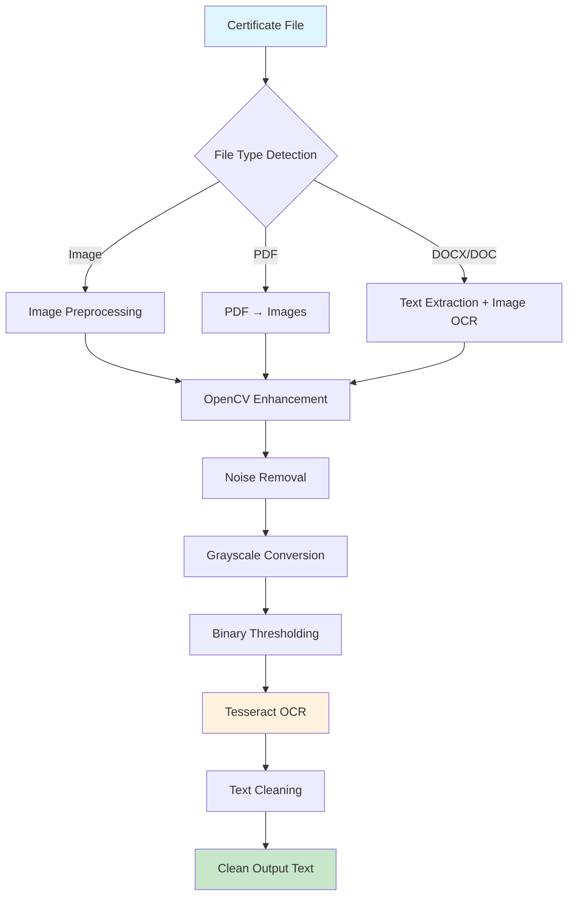

# OCR Certificate Processing Pipeline

This project provides a **robust OCR (Optical Character Recognition) pipeline** specifically designed for processing **internship certificates** and similar documents. It uses **Tesseract OCR** with intelligent preprocessing to extract clean text from various document formats including scanned PDFs, Word documents, and images.

## 🚀 Key Features

- **🔍 Advanced OCR Processing**: High-accuracy text extraction using Tesseract with OpenCV preprocessing
- **📄 Multi-Format Support**: PDF, DOCX, DOC, JPG, PNG, BMP, TIFF, and TIF files
- **🖼️ Intelligent Image Preprocessing**: Automatic noise removal, grayscale conversion, and binarization
- **📝 Enhanced Word Spacing**: Advanced algorithms to fix missing spaces in scanned documents and images
- **🇫🇮 Multi-Language Support**: Optimized processing for Finnish and English certificates
- **⚙️ Smart Configuration**: Auto-detection of Tesseract installation across platforms
- **📝 Clean Text Output**: Normalized and formatted text with whitespace cleaning
- **🛠️ Production Ready**: Type-safe, well-documented, and comprehensively tested

## 📁 OCR Pipeline Architecture

```
backend/src/ocr/
├── cert_extractor.py    # 🎯 Main certificate processing orchestrator
│   ├── extract_certificate_text()     # Entry point for all file types
│   ├── _extract_from_image()          # Image file processing
│   ├── _extract_from_pdf()            # PDF to image conversion + OCR
│   ├── _extract_from_docx()           # Word document text + image OCR
│   └── _clean_text()                  # Text normalization
│
└── ocr.py              # 🔧 Core OCR engine and preprocessing
    ├── OCRProcessor class             # Main OCR functionality
    ├── extract_text()                 # Text extraction with preprocessing
    ├── extract_data()                 # Detailed OCR data with coordinates
    ├── _prepare_image()               # Multi-format image conversion
    └── _preprocess_image()            # OpenCV enhancement pipeline
```

## 🔄 Processing Workflow



## 🛠️ Installation & Setup

### 1. Prerequisites

**Install Tesseract OCR** (required for text extraction):

**Windows:**
```powershell
# Option 1: Official installer (Recommended)
# Download from: https://github.com/UB-Mannheim/tesseract/wiki
# Install tesseract-ocr-w64-setup-v5.3.0.exe or later

# Option 2: Package managers
choco install tesseract          # Chocolatey
scoop install tesseract          # Scoop
```

**macOS:**
```bash
brew install tesseract           # Homebrew
sudo port install tesseract     # MacPorts
```

**Linux:**
```bash
# Ubuntu/Debian
sudo apt update && sudo apt install tesseract-ocr

# CentOS/RHEL/Fedora
sudo dnf install tesseract       # Fedora
sudo yum install tesseract       # CentOS/RHEL
```

**Verify Installation:**
```bash
tesseract --version
# Should output: tesseract 5.x.x
```

### 2. Python Environment Setup

```bash
# Clone and navigate to project
git clone <repository-url>
cd backend

# Create and activate virtual environment
python -m venv venv

# Windows
venv\Scripts\Activate

# macOS/Linux  
source venv/bin/activate

# Install dependencies
pip install -r requirements.txt
```

## 💻 Usage Examples

### Basic Certificate Processing

```python
from src.ocr.cert_extractor import extract_certificate_text

# Process different file types
pdf_text = extract_certificate_text("certificates/internship_cert.pdf")
docx_text = extract_certificate_text("certificates/letter.docx") 
image_text = extract_certificate_text("certificates/scanned_cert.jpg")

print("Extracted text:", pdf_text)

# Enhanced word spacing for scanned documents
scanned_text = extract_certificate_text("certificates/scanned_cert.pdf")
print("Scanned with proper word spacing:", scanned_text)
```

### Advanced OCR with Custom Settings

```python
from src.ocr.ocr import ocr_processor
from PIL import Image

# Load and process image with custom configuration
image = Image.open("certificate.png")

# Extract text with Finnish language support
finnish_text = ocr_processor.extract_text(
    image, 
    lang="fin",  # Finnish OCR
    config="--oem 3 --psm 6 -c tessedit_char_whitelist=ABCDEFGHIJKLMNOPQRSTUVWXYZabcdefghijklmnopqrstuvwxyzÄÖäö0123456789.,: "
)

# Get detailed OCR data with coordinates and confidence scores
ocr_data = ocr_processor.extract_data(image, lang="eng")
for i, text in enumerate(ocr_data['text']):
    if text.strip():
        confidence = ocr_data['conf'][i]
        x, y, w, h = ocr_data['left'][i], ocr_data['top'][i], ocr_data['width'][i], ocr_data['height'][i]
        print(f"Text: '{text}' | Confidence: {confidence}% | Position: ({x},{y},{w},{h})")
```

### Batch Processing Multiple Files

```python
import os
from pathlib import Path
from src.ocr.cert_extractor import extract_certificate_text

def process_certificate_folder(folder_path: str) -> dict[str, str]:
    """Process all certificate files in a folder."""
    results = {}
    folder = Path(folder_path)
    
    # Supported file extensions
    supported_exts = {'.pdf', '.docx', '.doc', '.jpg', '.jpeg', '.png', '.bmp', '.tiff', '.tif'}
    
    for file_path in folder.iterdir():
        if file_path.suffix.lower() in supported_exts:
            try:
                text = extract_certificate_text(file_path)
                results[file_path.name] = text
                print(f"✅ Processed: {file_path.name}")
            except Exception as e:
                results[file_path.name] = f"Error: {e}"
                print(f"❌ Failed: {file_path.name} - {e}")
    
    return results

# Process all certificates in samples folder
results = process_certificate_folder("samples/")
```

### Real-time Processing with Error Handling

```python
from src.ocr.cert_extractor import extract_certificate_text
from src.utils.logger import get_logger

logger = get_logger(__name__)

def safe_extract_text(file_path: str) -> tuple[str, bool, str]:
    """
    Safely extract text with comprehensive error handling.
    
    Returns:
        tuple: (extracted_text, success_flag, error_message)
    """
    try:
        text = extract_certificate_text(file_path)
        
        if not text.strip():
            return "", False, "No text could be extracted from the document"
        
        # Validate extracted text quality
        if len(text) < 10:
            logger.warning(f"Very short text extracted from {file_path}: '{text}'")
        
        return text, True, ""
        
    except ValueError as e:
        return "", False, f"Unsupported file format: {e}"
    except FileNotFoundError:
        return "", False, f"File not found: {file_path}"
    except Exception as e:
        logger.exception(f"Unexpected error processing {file_path}")
        return "", False, f"Processing error: {e}"

# Usage
text, success, error = safe_extract_text("certificate.pdf")
if success:
    print(f"Extracted: {text[:100]}...")
else:
    print(f"Error: {error}")
```

## ⚙️ Configuration

### Environment Variables

Create a `.env` file for custom configuration:

```env
# Tesseract Configuration
TESSERACT_CMD=C:\Program Files\Tesseract-OCR\tesseract.exe  # Windows custom path
# TESSERACT_CMD=/usr/local/bin/tesseract                    # macOS custom path

# Application Settings  
DEBUG=true
ENVIRONMENT=development
APP_NAME=OCR Certificate Processor
```

### OCR Language Support

```python
from src.ocr.ocr import ocr_processor

# Check available languages
languages = ocr_processor.get_available_languages()
print("Available languages:", languages)

# Common language codes:
# 'eng' - English
# 'fin' - Finnish  
# 'swe' - Swedish
# 'deu' - German
# 'fra' - French
```

## 🧪 Testing

### Quick Test Script

```python
# test_pipeline.py
from src.ocr.cert_extractor import extract_certificate_text
from pathlib import Path

def test_pipeline():
    """Test the OCR pipeline with sample files."""
    sample_dir = Path("samples")
    
    if not sample_dir.exists():
        print("❌ samples/ directory not found")
        return
    
    files_tested = 0
    files_success = 0
    
    for file_path in sample_dir.iterdir():
        if file_path.suffix.lower() in {'.pdf', '.docx', '.doc', '.jpg', '.jpeg', '.png'}:
            files_tested += 1
            try:
                text = extract_certificate_text(file_path)
                if text.strip():
                    files_success += 1
                    print(f"✅ {file_path.name}: {len(text)} characters extracted")
                else:
                    print(f"⚠️  {file_path.name}: No text extracted")
            except Exception as e:
                print(f"❌ {file_path.name}: {e}")
    
    print(f"\n📊 Results: {files_success}/{files_tested} files processed successfully")

if __name__ == "__main__":
    test_pipeline()
```

```bash
# Run the test
python test_pipeline.py
```

## 🔧 Troubleshooting

### Common Issues & Solutions

**1. Tesseract Not Found Error**
```bash
# Verify installation
tesseract --version

# Check PATH (Windows)
echo $env:PATH | Select-String "tesseract"

# Check PATH (macOS/Linux)  
echo $PATH | grep tesseract

# Manual configuration in .env
TESSERACT_CMD=/full/path/to/tesseract
```

**2. Poor OCR Accuracy**
```python
# Tips for better results:
# - Use high-resolution images (300+ DPI)
# - Ensure good contrast between text and background
# - Avoid skewed or rotated text
# - Use clean, noise-free scans

# Custom preprocessing for difficult documents:
from src.ocr.ocr import ocr_processor
import cv2
import numpy as np

def enhance_difficult_image(image_path):
    """Enhanced preprocessing for low-quality documents."""
    image = cv2.imread(image_path)
    
    # Convert to grayscale
    gray = cv2.cvtColor(image, cv2.COLOR_BGR2GRAY)
    
    # Apply adaptive thresholding
    thresh = cv2.adaptiveThreshold(gray, 255, cv2.ADAPTIVE_THRESH_GAUSSIAN_C, cv2.THRESH_BINARY, 11, 2)
    
    # Morphological operations to clean up
    kernel = np.ones((2,2), np.uint8)
    cleaned = cv2.morphologyEx(thresh, cv2.MORPH_CLOSE, kernel)
    
    # Extract text
    return ocr_processor.extract_text(cleaned, preprocess=False)
```

**3. PDF Processing Issues**
```bash
# Install poppler for PDF support:

# Windows: Download from https://github.com/oschwartz10612/poppler-windows
# Add to PATH or extract to project folder

# macOS:
brew install poppler

# Linux:
sudo apt-get install poppler-utils
```

**4. Memory Issues with Large Files**
```python
# For large documents, process page by page:
def process_large_pdf(pdf_path, max_pages=None):
    """Process large PDFs with memory management."""
    from pdf2image import convert_from_path
    
    images = convert_from_path(pdf_path, first_page=1, last_page=max_pages)
    texts = []
    
    for i, image in enumerate(images):
        print(f"Processing page {i+1}/{len(images)}")
        text = ocr_processor.extract_text(image)
        texts.append(text)
        
        # Clear memory
        del image
    
    return "\n\n--- Page Break ---\n\n".join(texts)
```

## 📊 Performance Optimization

### Processing Speed Tips

```python
# 1. Skip preprocessing for clean documents
text = ocr_processor.extract_text(image, preprocess=False)

# 2. Use specific PSM modes for different document types
configs = {
    'single_block': '--psm 6',      # Single uniform block of text
    'single_line': '--psm 7',       # Single text line  
    'single_word': '--psm 8',       # Single word
    'single_char': '--psm 10',      # Single character
}

# 3. Limit character whitelist for known document types
certificate_config = "--oem 3 --psm 6 -c tessedit_char_whitelist=ABCDEFGHIJKLMNOPQRSTUVWXYZabcdefghijklmnopqrstuvwxyz0123456789.,:-/ "
```

## 📈 Integration Examples

### FastAPI Integration

```python
from fastapi import FastAPI, UploadFile, HTTPException
from src.ocr.cert_extractor import extract_certificate_text
import tempfile

app = FastAPI(title="OCR Certificate API")

@app.post("/extract-text/")
async def extract_text_endpoint(file: UploadFile):
    """Extract text from uploaded certificate file."""
    
    # Validate file type
    allowed_types = {'application/pdf', 'image/jpeg', 'image/png', 'application/vnd.openxmlformats-officedocument.wordprocessingml.document'}
    if file.content_type not in allowed_types:
        raise HTTPException(status_code=400, detail="Unsupported file type")
    
    # Save uploaded file temporarily
    with tempfile.NamedTemporaryFile(delete=False, suffix=file.filename) as tmp_file:
        content = await file.read()
        tmp_file.write(content)
        tmp_file_path = tmp_file.name
    
    try:
        # Extract text
        extracted_text = extract_certificate_text(tmp_file_path)
        
        return {
            "filename": file.filename,
            "extracted_text": extracted_text,
            "character_count": len(extracted_text),
            "word_count": len(extracted_text.split())
        }
    
    except Exception as e:
        raise HTTPException(status_code=500, detail=f"Text extraction failed: {e}")
    
    finally:
        # Clean up temporary file
        os.unlink(tmp_file_path)
```

## 📚 Dependencies

```txt
# Core OCR and Image Processing
pytesseract==0.3.13          # Tesseract Python wrapper
opencv-python==4.11.0.86     # Image preprocessing
Pillow==11.2.1                # Image handling

# Document Processing  
pdf2image==1.17.0             # PDF to image conversion
python-docx==1.2.0            # Word document processing
docx2txt==0.9                 # Text extraction from DOCX

# Configuration Management
pydantic==2.11.7              # Settings validation
pydantic-settings==2.10.1     # Environment-based config
python-dotenv==1.1.1          # .env file support

# Utilities
numpy==2.3.1                  # Numerical operations
```

## 🤝 Contributing

1. **Code Style**: Follow PEP 8 guidelines using `ruff`
2. **Type Hints**: All functions must have complete type annotations
3. **Documentation**: Google-style docstrings required
4. **Testing**: Minimum 90% test coverage with pytest
5. **Logging**: Use the provided logger for all operations

```bash
# Development setup
pip install ruff mypy pytest pre-commit
pre-commit install

# Run quality checks
ruff check .
mypy src/
pytest tests/ -v --cov=src --cov-report=html
```

## 📄 License

This project is developed for OAMK internship workflow automation. See license file for details.

---

**Need help?** Check the troubleshooting section above or create an issue with:
- Your operating system and Python version
- Complete error messages
- Sample file (if possible)
- Steps to reproduce the issue


